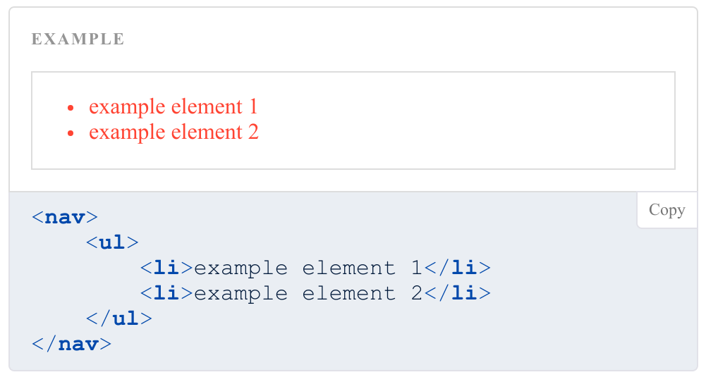

# sg-example

A web component for displaying code examples in styleguides.

## Usage

```html
<style>
    nav {
        border: 1px solid #ddd;
    }
    li {
        background-color: #fff;
        color: #f43;
    }
</style>
<sg-example>
    <nav>
        <ul>
            <li>example element 1</li>
            <li>example element 2</li>
        </ul>
    </nav>
</sg-example>
```

Gives this output:


